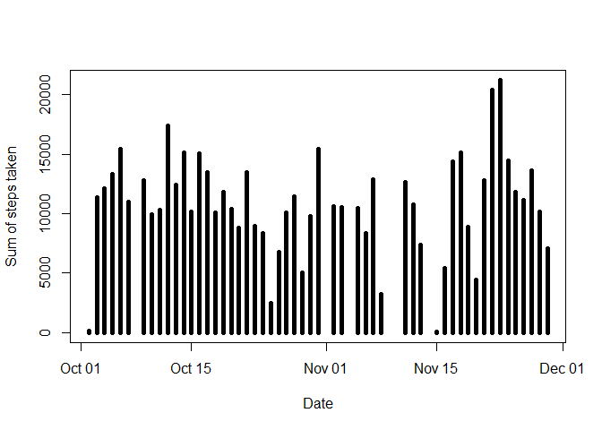

---
output:
  html_document: 
    keep_md: yes
  pdf_document: default
---
Week2 assignment
================

#Loading and preprocessing the data

```r
unzip("activity.zip", exdir = ".")
mydata<-read.csv("activity.csv")
summary(mydata)
```

```
##      steps            date              interval     
##  Min.   :  0.00   Length:17568       Min.   :   0.0  
##  1st Qu.:  0.00   Class :character   1st Qu.: 588.8  
##  Median :  0.00   Mode  :character   Median :1177.5  
##  Mean   : 37.38                      Mean   :1177.5  
##  3rd Qu.: 12.00                      3rd Qu.:1766.2  
##  Max.   :806.00                      Max.   :2355.0  
##  NA's   :2304
```

```r
str(mydata)
```

```
## 'data.frame':	17568 obs. of  3 variables:
##  $ steps   : int  NA NA NA NA NA NA NA NA NA NA ...
##  $ date    : chr  "2012-10-01" "2012-10-01" "2012-10-01" "2012-10-01" ...
##  $ interval: int  0 5 10 15 20 25 30 35 40 45 ...
```

#What is mean total number of steps taken per day?
##Calculate the total number of steps taken per day

```r
library(dplyr)
```

```
## 
## Attaching package: 'dplyr'
```

```
## The following objects are masked from 'package:stats':
## 
##     filter, lag
```

```
## The following objects are masked from 'package:base':
## 
##     intersect, setdiff, setequal, union
```

```r
mydata %>% 
  group_by(date) %>% 
  summarise(Total = sum(steps, na.rm = TRUE))
```

```
## # A tibble: 61 x 2
##    date       Total
##    <chr>      <int>
##  1 2012-10-01     0
##  2 2012-10-02   126
##  3 2012-10-03 11352
##  4 2012-10-04 12116
##  5 2012-10-05 13294
##  6 2012-10-06 15420
##  7 2012-10-07 11015
##  8 2012-10-08     0
##  9 2012-10-09 12811
## 10 2012-10-10  9900
## # ... with 51 more rows
```
## Make a histogram of the total number of steps taken each day

```r
Total<-summarise(group_by(mydata,date), Total=sum(steps))
Total<-Total[!is.na(Total$Total),]
plot(as.Date(Total$date),Total$Total,lwd=5, type="h",xlab = "Date", ylab = "Sum of steps taken")
```

<!-- -->
